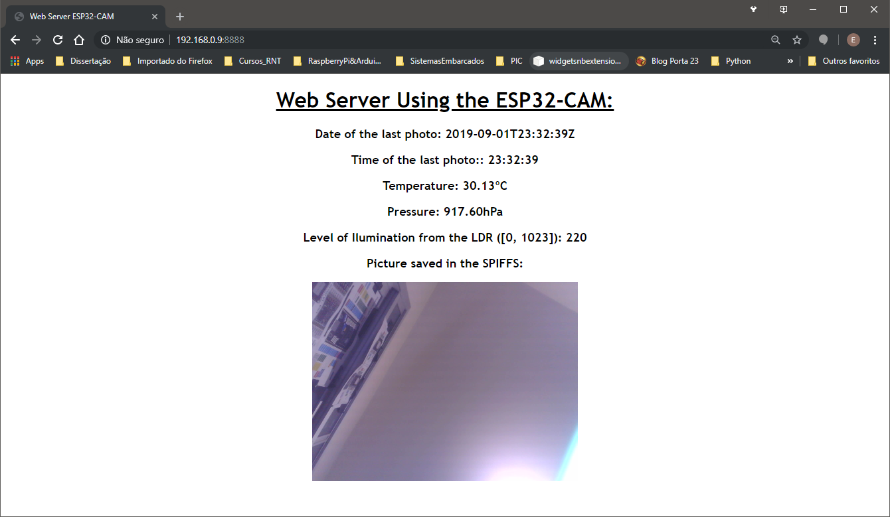

# ESP32-CAM Web Server publishing the last picture saved in the SPIFFS and publishing data from a MQTT server         
       

        
      
	
 - This repo contains the code for a web server, using the ESP32-CAM, which publishes the last picture taken by the camera.      
 - The picture is saved on the SPIFFS of the ESP32-CAM. It only saves one picture (everytime that a picture is taken, it replaces the existing one).        
 - The web server page shows the last picture taken by the camera and also shows some sensor readings.       
	- Once I had problems in connecting the sensors to the ESP32-CAM, the ESP8266 module is connected to the sensors, and publish the readings in a MQTT server running in my Raspberry Pi.    
	- The ESP32-CAM connects to this MQTT server and publish the sensor readingsa in the web server page.      
 - This project was built over the idea shown in https://randomnerdtutorials.com/esp32-cam-take-photo-save-microsd-card/         
       
 
