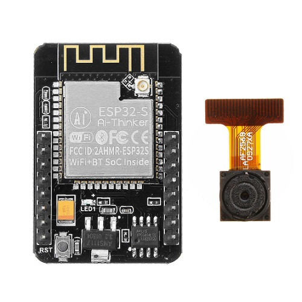
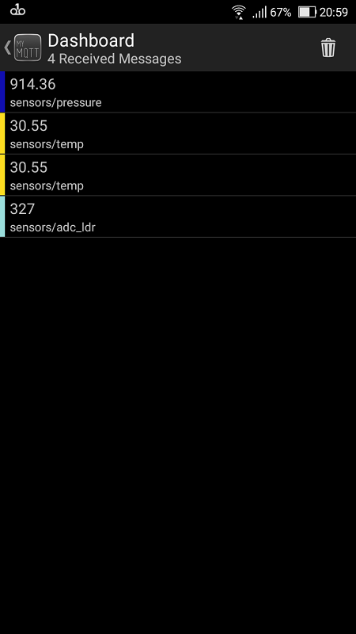
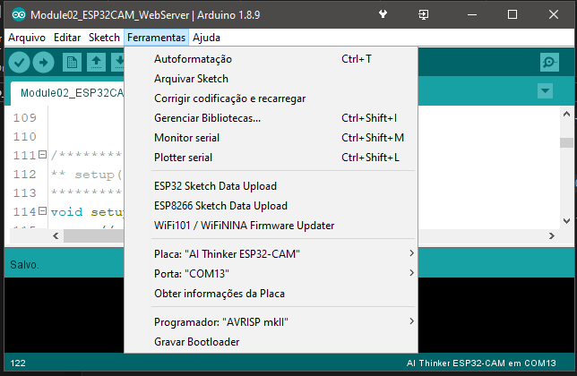
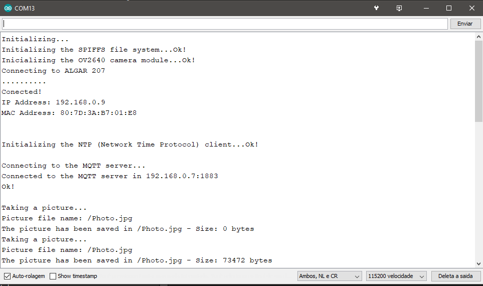
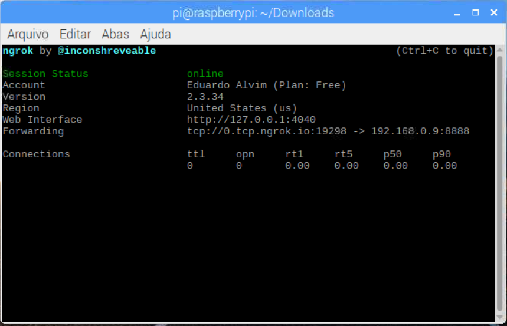
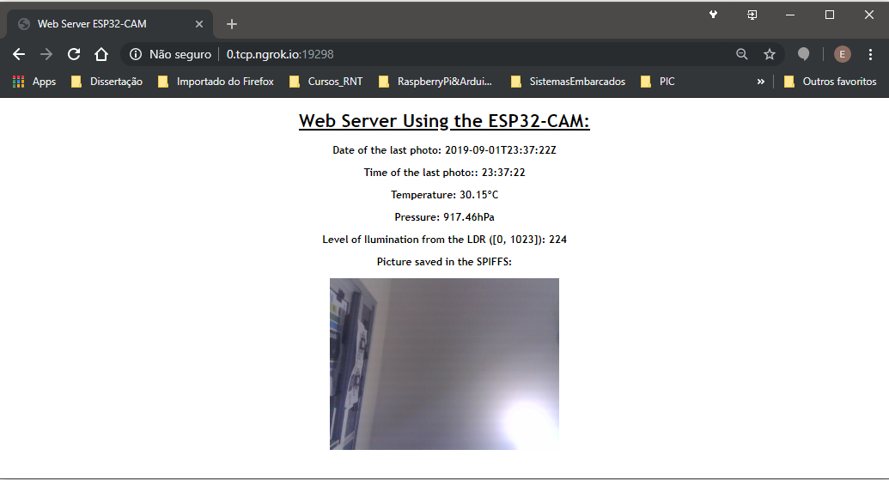

---
output:
  pdf_document: default
  html_document: default
---
# Relatório - Projeto - Servidor Web para publicação de uma foto e dados de sensores         
        

# 1 - Partes do Projeto e componentes utilizados:        
     
## 1.1 - As três partes do projeto:        
 - 1 - Circuito usando placa de desenvolvimento 'NodeMCU V1.0' - SoC ESP12-E (com microcontrolador ESP8266).       
	- Lê os dados de temperatura e pressão do módulo BMP280 e o valor analógico do sensor de iluminação (fotoresistor).      
	- Os dados dos sensores são enviados para o servidor MQTT.         
	- O NodeMCU é alimentado por meio de uma bateria 18650.      
	- A bateria é carregada por meio de painéis solares.       
 - 2 - Módulo ESP32-CAM:        
	- Tira uma foto a cada 5 minutos. Ele apenas armazena a última foto tirada.      
	- Esse módulo também hospeda o servidor web com a página que mostra os dados dos sensores e a ultima foto tirada com a câmera.       
	- Na memória flash do ESP32-CAM somente é armazenada a foto mostrada na página.        
	- O código HTML da página web é gerado nas funções do _sketch_ enviado para o ESP32-Cam.       
 - 3 - Computador executando o **Moquitto MQTT** e o programa Ngrok.      
	- No caso aqui, os programas estão instalados em um Raspberry Pi.      
	- Entretanto, qualquer computador com Windows pode fazer exatamente a mesma coisa. Somente é necessário instalar os programas mencionados.       
	- **Mosquitto MQTT**: É o programa que recebe os dados das leituras dos sensores, realizadas no NodeMCU ESP8266, e envia essas informações ao ESP32-CAM para incluir as leituras realizadas na página web gerada.     
	- **Ngrok**: é o serviço de internet que faz com que o servidor web do ESP32-CAM fique disponível na internet.      
		- Necessário criar uma conta no site.       
		- O site disponibiliza uma versão gratuita e, também, recursos pagos.      
		- Os recursos usados aqui foram os gratuitos.     
		

## 1.2 - Componentes utilizados no projeto:         
          
        
 - 1 - **NodeMCU (ESP12-E) com os sensores**:        
	- 1x Módulo de desenvolvimento NodeMCU 1.0 (SoC ESP12-E, com o chip ESP8266).       
	- 1x sensor de temperatura e pressão BMP280        
	- 1x sensor de iluminação (fotoresistor).      
	- 1x resistor de 4.7K        
	- 1x regulador de tensão DC-DC _Step-Up_ USB (de 0.9-5v para 5v, 600mA).         
	- 1x bateria 18650 (4.2V, 9800mAh).       
	- 1x Módulo carregador de baterias Li-ion **TP4056**, **COM PROTEÇÃO**.      
	- 4x paineis solares de 6V (embora o máximo que consegui medir foi pouco mais de 5V), 1W.        
	- 2x Cabos USB-A e Micro-USB. **Basta ser um cabo para alimentação. Não precisa dos recursos de transferência de dados**.       
       
          
         
 - 2 - **Módulo ESP32-CAM com o servidor Web**:        
	- 1x Módulo ESP32-CAM        
	- 1x Módulo programador **FT232R FTDI** (o ESP32-CAM não é programado de forma direta como nas placas NodeMCU).        
	- 1x Uma fonte de 5V
	 

# 2 - Diagramas e fotos dos circuitos:        
       

## 2.1 - Parte 1 - ESP8266 e sensores        
      

### 2.1.1 - Alimentação (painéis solares)           
        
         
        

### 2.1.2 - NodeMCU e Sensores           
        
         
        

### 2.1.3 - Selecionar o NodeMCU no Arduino IDE           
         
       

### 2.1.4 - Servidor MQTT:         
        
	   
 - Os valores retornados pelas leituras dos sensores são publicados no servidor MQTT executado no Raspberry Pi.       
 - O programa usado aqui é o **Moquito MQTT Broker**.        
 - A imagem acima mostra o resultado de uma subscrição ao tópico **`sensors/temp`**.      
        
        
       
 - Alternativamente, as leituras de um tópico MQTT também podem ser apresentadas no aplicativo **MyMQTT** (Android).       
 - A imagem acima mostra o MyMQTT recebendo os dados do servidor MQTT executado no Raspberry Pi.        
 - Os tópicos subscritos foram:         
	- **`sensors/temp`**.     
	- **`sensors/pressure`**.     
	- **`sensors/adc_ldr`**.     
       
       

## 2.2 - Parte 2 -  ESP32-CAM         
     

### 2.2.1 - Programação do ESP32-CAM        
        
        
       
 - O ESP32-CAM precisa de ser programado através de um programador FTDI.       
	- Nas imagens acima, ele está sendo programado usando um módulo **FT232R FTDI**.      
	- No momento de programar o ESP32-CAM, colocá-lo em _boot mode_, **conectando os pinos `IO0` e `GND`**.        
	 

### 2.2.2 - Selecionando o ESP32-CAM no Arduino IDE:         
       
       

### 2.2.3 - Execução         
        
        
       
 - Para executar o _sketch_ enviado para o ESP32-CAM, basta remover o fio conectando os pinos `IO0` e `GND`.      
      

### 2.2.4 - O Servidor Web no ESP32-CAM:        
        
        
        
 - Como mostra o output no Arduino IDE, o sevidor web está disponível na rede Wi-Fi no endereço **`192.168.0.9:8888`**.         
      

### 2.2.5 - O serviço de redirecionamento Ngrok:       
        
        
        
 - Antes de realizar o procedimento, se cadastrar no site do Ngrok, baixar, instalar e configurar o programa do Ngrok.       
 - Procedimento:      
	- 1 - Ir para o diretório onde o Ngrok está instalado (no Windows, caso tenha adicionado o caminho para o executável do Ngrok à variável de ambiente `PATH`, esse procedimento não é necessário).          
	- 2 - Executar Ngrok especificando o endereo do servidor web na rede Wi-Fi:      
		- **Raspberry Pi**: `./ngrok tcp 192.168.0.9:8888`          
		- **Windows Power Shell**: `ngrok tcp 192.168.0.9:8888`      
		- Lembrando que o endereço especificado nos comandos acima somente valem no caso do endereço de IP do ESP32-CAM na rede Wi-Fi ser `192.168.0.9`.          
	- O output mostrado na primeira imagem mostra que o endereço de internet para acessar o servidor web em qualquer lugar é: **`http://0.tcp.ngrok.io:19298/` **.      
      	
