---
output:
  pdf_document: default
  html_document: default
---
# Project - Web server publishing ESP32-CAM pictures and sensor data readings from a MQTT server:        
        

# 1 - Project Modules and Required Parts:        
     
## 1.1 - The three modules of the project:        
 - 1 - Module using the 'NodeMCU V1.0' board with SoC ESP12-E (with ESP8266 microcontroller).       
	- Reads the temperature (in ºC) and air pressure (in hPa) from the BMP280 module and the ADC value from the Light Dependent Resistor (LDR).       
	- The data read from the sensors are sent to the MQTT server.         
	- The NodeMCU is power-supplied by a 18650 battery.      
	- The 18650 battery is charged by a TP4056 module and four solar panels.       
 - 2 - ESP32-CAM Module:        
	- Take a picture every five minutes. It just stores the last picture taken, in the SPIFFS memory of the ESP32-CAM.      
	- This module hosts the web server HTML page which shows the last picture taken and the sensor data.       
	- The HTML code of the wep page is generated in a function of the sketch of this module.       
	- The template of the web page is hosted in the header file 'PAG_WEB.h'
 - 3 - PC executing **Moquitto MQTT** and Ngrok.      
	- Here, I used a Raspberry Pi with the necessary software installed.       
	- But its not a requisite to use a Raspberry Pi here. Any computer with windows will do the same thing. It just needs the required software.   
	- **Mosquitto MQTT**: Its the MQTT server program. It receives the published data from the NodeMCU ESP8266 and sends the published data to the ESP32-CAM (the subscriber).      
	- **Ngrok**: Its the internet server which redirects the ESP32-CAM web server to the internet.    
		- It requires an account in the Ngrok site.        
		- It offers some free services, like the one shown here. But the site has some paid services too.        
		- I'm using here only its free services.     
		

## 1.2 - Parts used in each module of the project:         
          
        
 - 1 - **NodeMCU (ESP12-E) with the sensors**:        
	- 1x NodeMCU 1.0 module (SoC ESP12-E, with the ESP8266 microcontroller).       
	- 1x BMP280 sensor module (temperature and air pressure)        
	- 1x light dependent resistor (LDR).      
	- 1x 4.7K resistor.               
	- 1x DC-DC step-up USB voltage regulator (from 0.9-5V to 5V - 600 mA - with a USB-A output).        
	- 1x 18650 battery (4.2V, 9800mAh).       
	- 1x Li-ion battery charger module **TP4056**, **WITH PROTECTION**.      
	- 4x 1W 6V solar panels (the specifications told that they were 6V panels, but my measurements showed 5V-2.15V).        
	- 2x USB cables, with a USB-A and a USB Micro-B terminals. **A charging-only cable does this service very well**.              
       
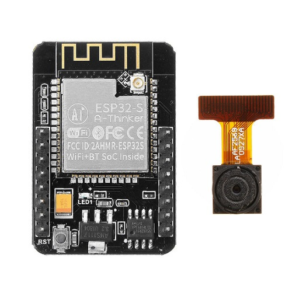          
         
 - 2 - **Módulo ESP32-CAM with the web server**:        
	- 1x ESP32-CAM module       
	- 1x **FT232R FTDI** programmer (the ESP32-CAM doesn't contain a CP2101 chip to transfer the sketches to it).        
	- 1x 5V DC power supply. 
	 

# 2 - Diagrams and photos:        
       

## 2.1 - Part 1 - ESP8266 and sensors        
      

### 2.1.1 - Power Supply (solar panels and battery charger)           
         
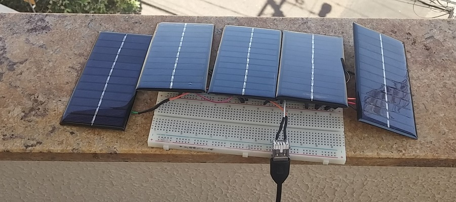        
        

### 2.1.2 - NodeMCU and Sensores           
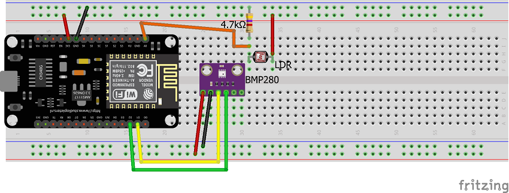         
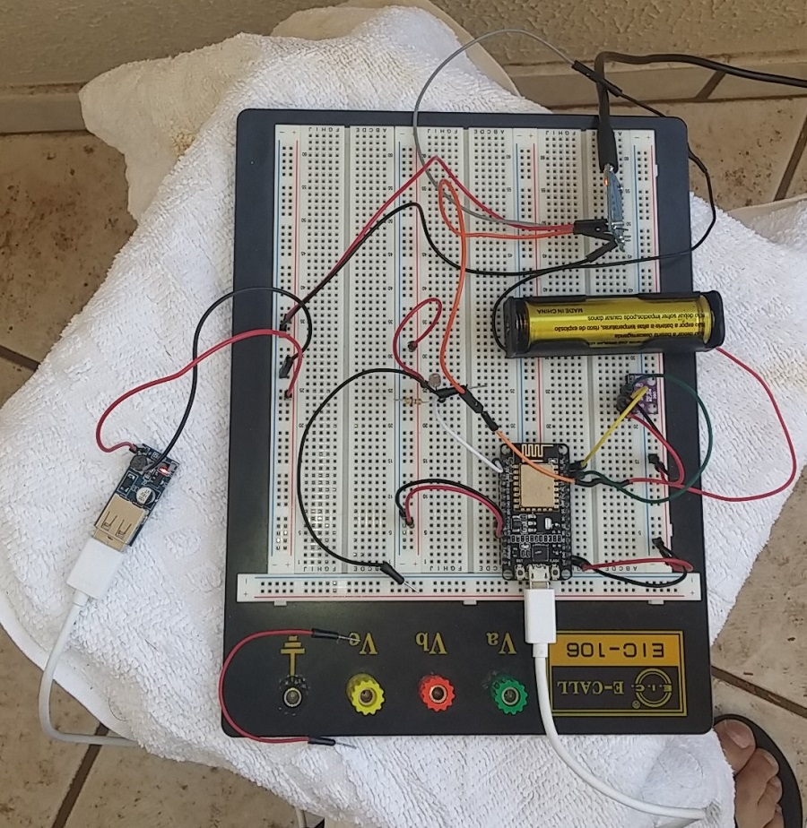        
        

### 2.1.3 - Selecting the NodeMCU board in Arduino IDE           
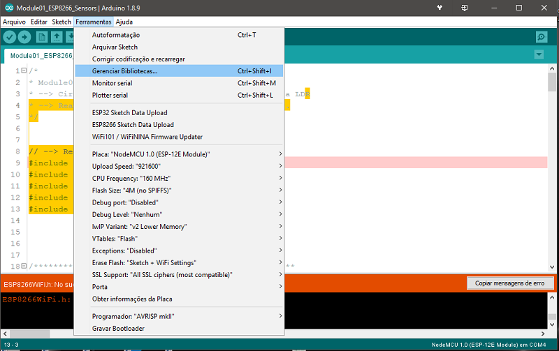         
        

### 2.1.4 - MQTT Server:         
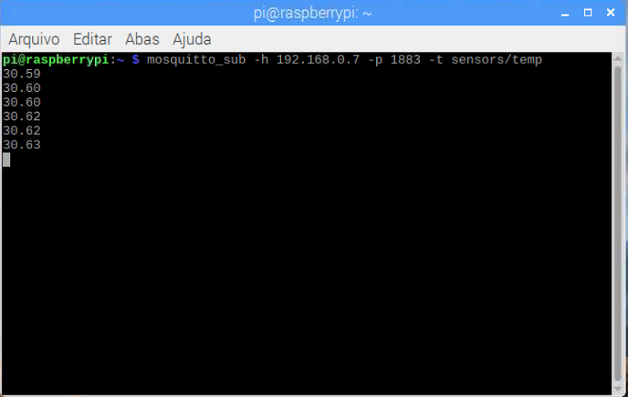        
	   
 - The sensor readings are published in the MQTT Server running on Raspberry Pi.        
 - The MQTT server program used here is the **Moquito MQTT Broker**.     
 - The picture above shows the result of a subscription to the topic **`sensors/temp`**.      
        
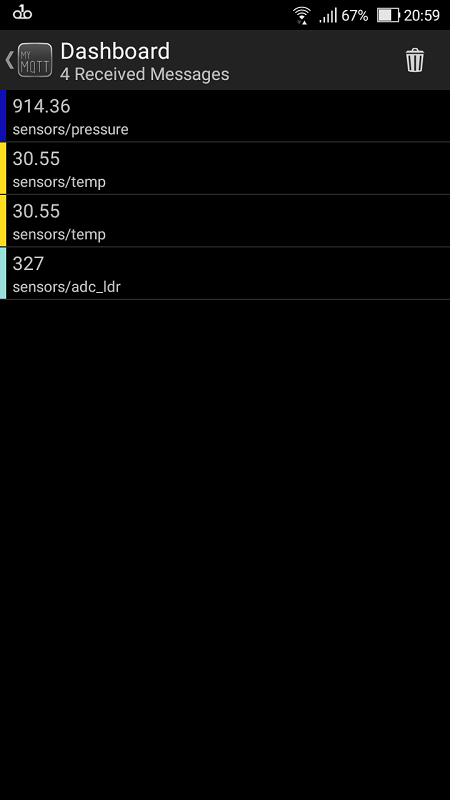        
       
 - Alternativelly, you can subscribe for a MQTT with the **MyMQTT** App (Android).        
 - The image above shows the result on the MyMQTT App, after connecting to my MQTT server in Raspberry Pi and subscribint to the following topics:        
	- **`sensors/temp`**.     
	- **`sensors/pressure`**.     
	- **`sensors/adc_ldr`**.     
       

## 2.2 - Part 2 -  ESP32-CAM         
     

### 2.2.1 - Programming the ESP32-CAM with the FT232R FTDI        
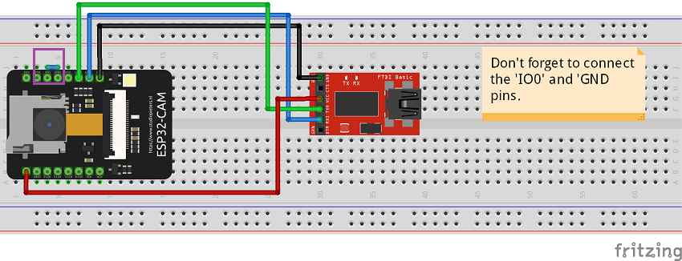        
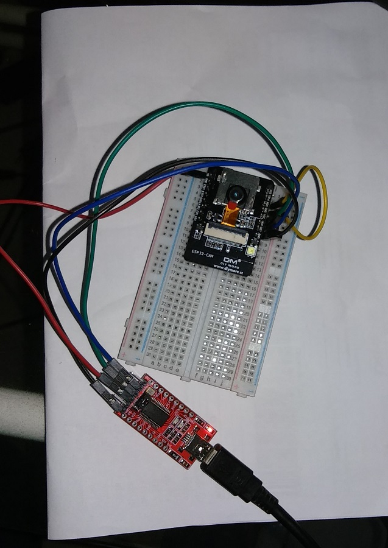        
       
 - The image above shows hw to connect the ESP32-CAM to the FT232R FTDI programmer.       
 - The **`IO0`** pin of the ESP32-CAM must be connected to the **`GND`** pin of the ESP32-CAM.     
      

### 2.2.2 - Selecting the ESP32-CAM in Arduino IDE:         
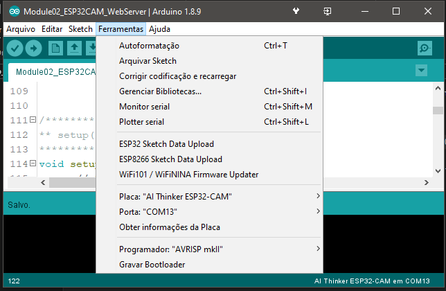       
       

### 2.2.3 - Running the sketch        
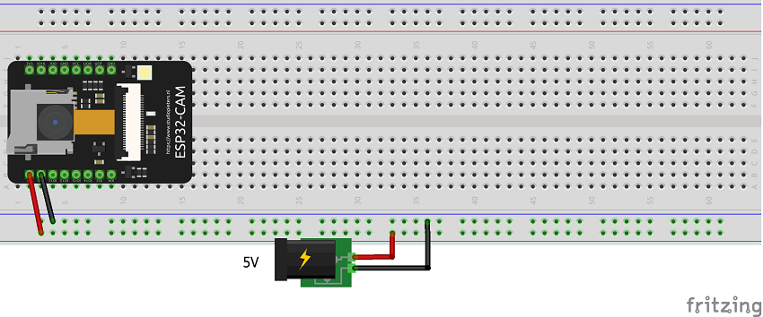        
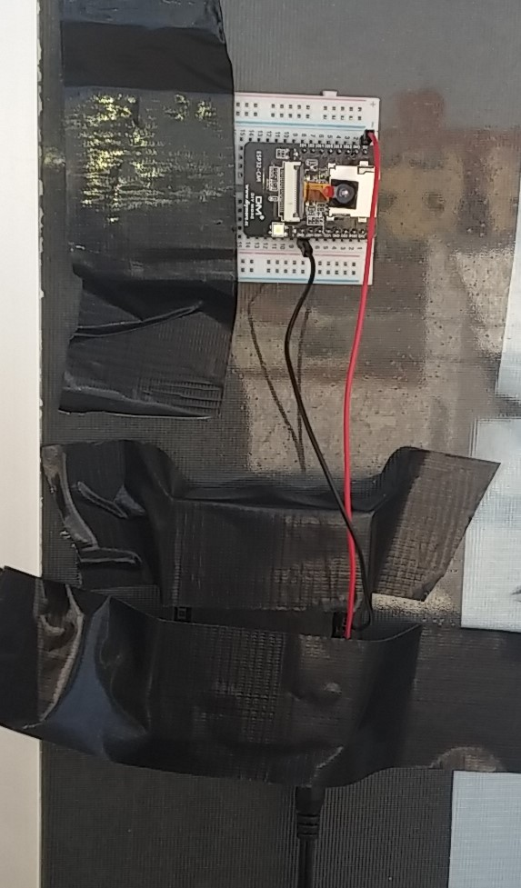        
       
 - I Used here an broken Arduino UNO, whose power-supply pins were the only pins working.        
 - But any 5V DC power-supply will do the same.           
 - Don't forget to remove the wire connecting the pins `IO0` and `GND`.        
         

### 2.2.4 - The ESP32-CAM Web server:       
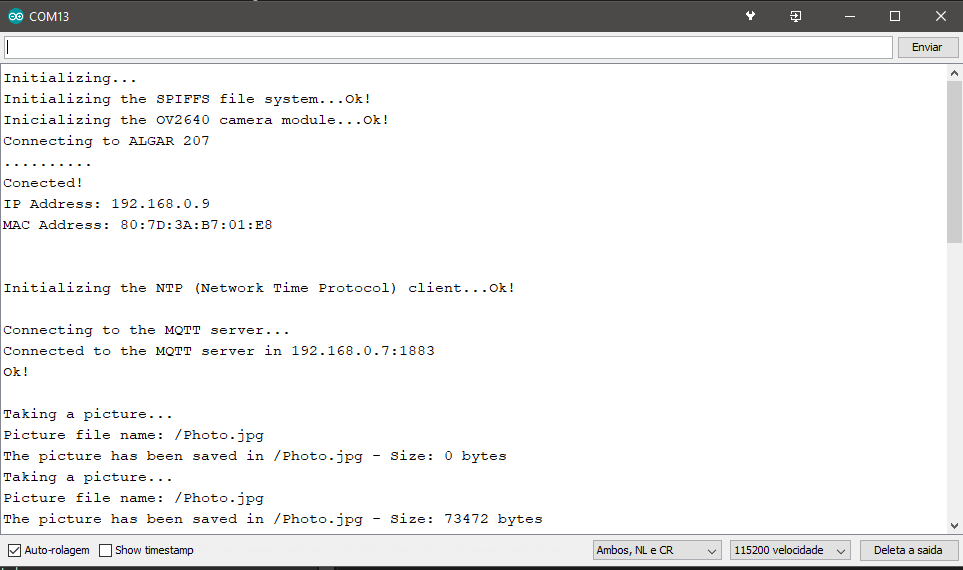        
        
        
 - The first image above shows the output in Monitor Serial of the Arduino IDE.     
 - The ESP32-CAM IP address in my Wi-Fi network is **192.168.0.9**.        
 - To access the web server (second image above), just type in your internet browser the IP address of the ESP32-CAM and the port number (in my case, **`192.168.0.9:8888`**).   
         

### 2.2.5 - The Ngrok redirection service:        
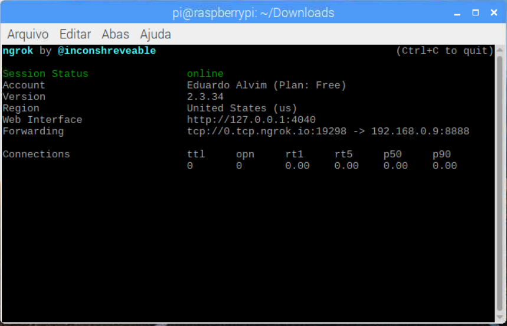        
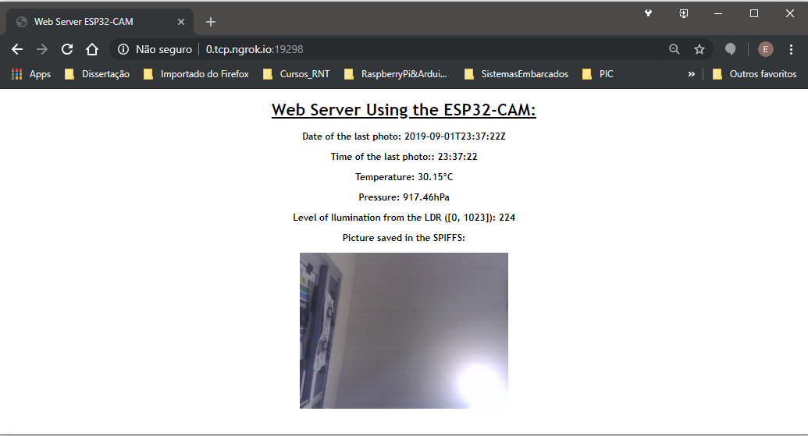        
        
 - After install and configure the Ngrok program in your Raspberry Pi or PC, and with the web server of the ESP32-CAM running, you can execute the Ngrok to make the web server available in the internet.       
 - In Raspberry Pi:      
	- Go to the folder where the Ngrok program is installed: `cd /home/pi/Downloads` (Or the folder which you installed it).         
	- Execute Ngrok: 
		- **Raspberry Pi**: `./ngrok tcp 192.168.0.9:8888`          
		- **Windows Power Shell**: `ngrok tcp 192.168.0.9:8888`        
 - The ouput shown in the first image above shows that my web server is available in the address `http://0.tcp.ngrok.io:19298/`        
 - To access your web server outside your Wi-Fi network, just type this address (`http://0.tcp.ngrok.io:19298/` ) in any internet browseer.        
          

	